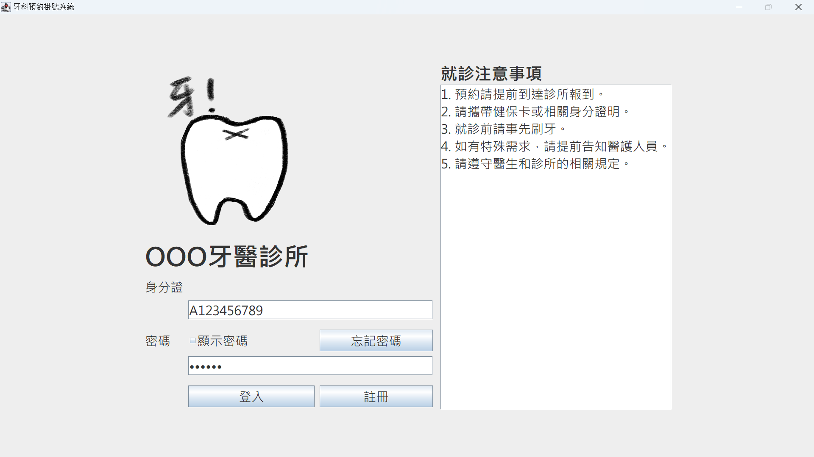
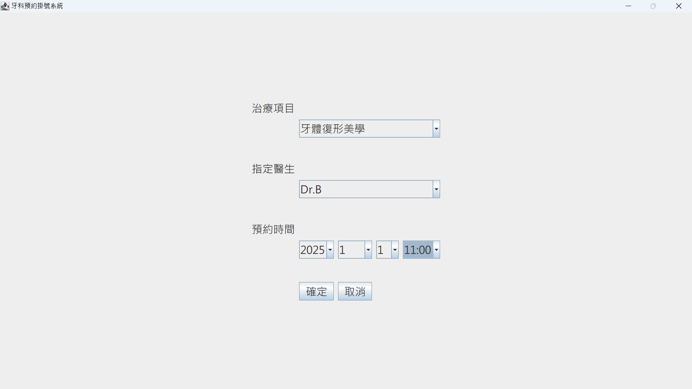
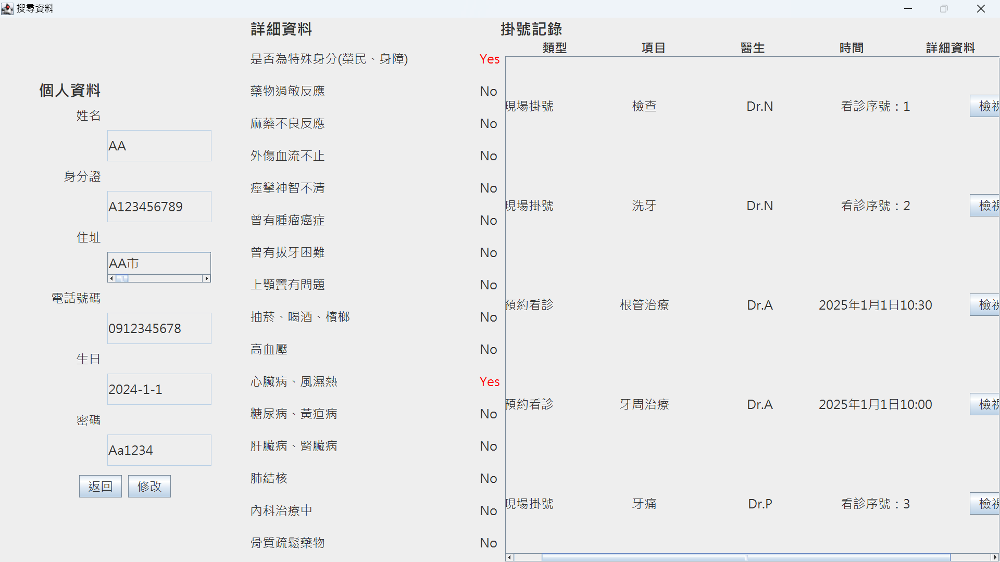
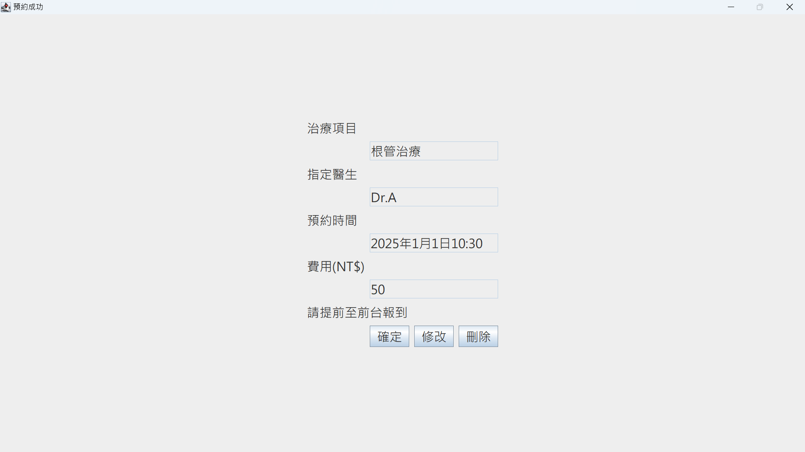

# DentalAppointmentSystem 牙醫掛號系統

## 目錄
- [專案介紹](#專案介紹)
- [功能特色](#功能特色)
- [系統架構](#系統架構)
- [安裝與使用](#安裝與使用)
- [使用範例](#使用範例)
- [類別設計](#類別設計)
- [作者](#作者)

## 專案介紹
牙醫掛號系統是一個 Java Swing 應用程式，提供患者掛號、修改、刪除預約的功能，並區分一般患者與特殊患者（如榮民、身障人士）。

## 功能特色
- **患者註冊與登入**
- **用戶認證**：系統會驗證病人的身份和密碼，並顯示相應的錯誤信息。
- **掛號管理**（新增、修改、刪除掛號資訊）
- **醫生管理**（指定預約醫生或現場掛號醫生）
- **病歷資料管理**（病患詳細資訊）

## 系統架構
```
📁 DentalAppointmentSystem
├── 📁 src
│   ├── StartPage.java  # 起始頁面
│   ├── SignUpPage.java  # 註冊頁面
│   ├── SearchPage.java  # 搜尋頁面
│   ├── ReviewPage.java  # 查詢看診資料
│   ├── On_sitePage.java  # 現場掛號頁面
│   ├── On_siteInfoPage.java  # 掛號資訊顯示頁面
│   ├── AppointedPage.java  # 預約頁面
│   ├── AppointedInfoPage.java  # 預約資訊顯示頁面
│   ├── BasicInfoPage.java  # 病患個人資料頁面
│   ├── AuthenticationPage.java  # 身份驗證頁面
│   ├── AppointmentSystem.java  # 掛號管理類別
│   ├── Dentist.java  # 牙醫抽象類別
│   ├── AppointedDentist.java  # 指定預約醫生
│   ├── On_siteDentist.java  # 現場掛號醫生
│   ├── Patient.java  # 病患抽象類別
│   ├── SpecialPatient.java  # 特殊病患（榮民、身障）
│   ├── NormalPatient.java  # 一般病患
│   ├── Verification.java # 驗證
│   ├── Detail.java  # 病歷詳細資訊
│   ├── Register.txt  # 註冊資料
│   ├── Patient.txt  # 病人資料
│   ├── Dentist.txt  # 醫師資料

└── 📁 resources
    └── LOGO.png  # 應用程式圖示
```

## 安裝與使用
1. **下載專案**
   ```bash
   git clone https://github.com/your-username/DentalAppointmentSystem.git
   cd DentalAppointmentSystem
   ```
2. **開啟專案**
   - 使用 **Eclipse** 或 **IntelliJ IDEA** 載入專案。
   - 確保 JDK 17 或以上版本已安裝。

3. **設定編碼**
   - **本專案使用 Big5 編碼，請確保 IDE 內的檔案編碼為 Big5，以避免中文亂碼。**
   - **Eclipse 設定方式**：
     1. **右鍵** 點擊專案 → `Properties`（屬性）。
     2. 選擇 `Resource`（資源）。
     3. 在 `Text file encoding`（文字檔案編碼）選擇 **Other**，設定為 **Big5**。
     4. 按下 `Apply and Close`（套用並關閉）。
   - **IntelliJ IDEA 設定方式**：
     1. **開啟專案** 後，點擊 `File` → `Settings`（設定）。
     2. 進入 `Editor` → `File Encoding`（檔案編碼）。
     3. 在 `Project Encoding`（專案編碼） 和 `Default Encoding`（預設編碼） 選擇 **Big5**。
     4. 按下 `OK` 以套用設定。

4. **執行程式**
   - 在 IDE 中執行 `StartPage.java`。
   - 進入登入或註冊頁面。

## 使用範例

### 登入頁面
用戶可以輸入身分證號和密碼進行登入，以下是登入頁面的範例：


### 預約看診
選擇項目、醫生、看診時間，進行預約


### 查詢個人資料
在此會顯示用戶的個人資料、詳細資料、掛號紀錄


### 查詢預約看診
顯示用戶該筆預約的資訊，可進行預約修改



## 類別設計
### **病患 Patient (抽象類別)**

`Patient` 類別是所有病患類別的父類別，提供了病患的基本資料欄位及方法。

#### 屬性:
- `ID` (String) - 身分證號
- `name` (String) - 姓名
- `address` (String) - 住址
- `TEL` (String) - 電話
- `birth` (String) - 生日
- `charge` (int) - 掛號費
- `password` (String) - 登入密碼

---

### **一般病患 NormalPatient (具體類別)**
`NormalPatient` 是繼承自 `Patient` 類別的具體類別，專門表示一般病患。

#### 屬性:
- `COPAYFEE` (int) - 掛號費=150
- `HEALTHPREMIUM` (int) - 健保費（此屬性將由實作提供設定）


### **特殊病患 SpecialPatient (具體類別)**
`SpecialPatient` 是繼承自 `Patient` 類別的具體類別，專門表示特殊病患。

#### 屬性:
- `COPAYFEE` (int) - 掛號費=0
- `HEALTHPREMIUM` (int) - 健保費=50

### **詳細資料 (Detail) - 具體類別**

`Detail` 類別用來管理與病患相關的詳細健康資訊，將健康狀況以布林值記錄。

#### 屬性:
- `detailLinkedHashMap` (LinkedHashMap<String, Boolean>) - 用來儲存健康狀況標記及其對應的布林值，表示每個標記的狀況。

#### 方法:
- `add(String key)` - 新增一個項目到 `detailLinkedHashMap`，並將其預設值設為 `false`。
- `setDetail(String key, boolean value)` - 設置指定項目的狀況（布林值），並返回舊的值。
- `getDetail(String key)` - 獲取指定項目的狀況（布林值）。
- `getKeys()` - 獲取所有的項目名稱並以 `ArrayList<String>` 形式返回。
- `showDetail()` - 以字串形式顯示所有項目及其狀況（"yes" 或 "no"）。

### **牙醫 Dentist (抽象類別)**
`Dentist` 類別是所有牙醫類別的父類別，定義了牙醫的基本資料與約診時間。

#### 屬性:
- `name` (String) - 醫生姓名
- `TimeList` (TreeMap) - 約診時間
- `ID` (String) - 醫生編號

### **掛號系統 AppointmentSystem (控制類別)**

`AppointmentSystem` 類別負責管理病患的掛號與約診時間，提供新增、修改與刪除掛號的功能。

#### 方法:
- `addAppointment()` - 新增掛號
- `editAppointment()` - 修改掛號
- `deleteAppointment()` - 刪除掛號

## 類別間關聯

- `Patient` 類別為抽象類別，`NormalPatient` 與 `SpecialPatient` 為其具體子類別。
- `Detail` 類別用來提供病患的詳細健康資料，並與病患進行關聯。
- `Dentist` 類別作為所有牙醫類別的父類別，並管理病患的約診時間。
- `AppointmentSystem` 類別負責整體掛號系統的管理。

## 作者
- **傅珮茵 (4112029005)**
- **蔡侑容 (4112029008)**

